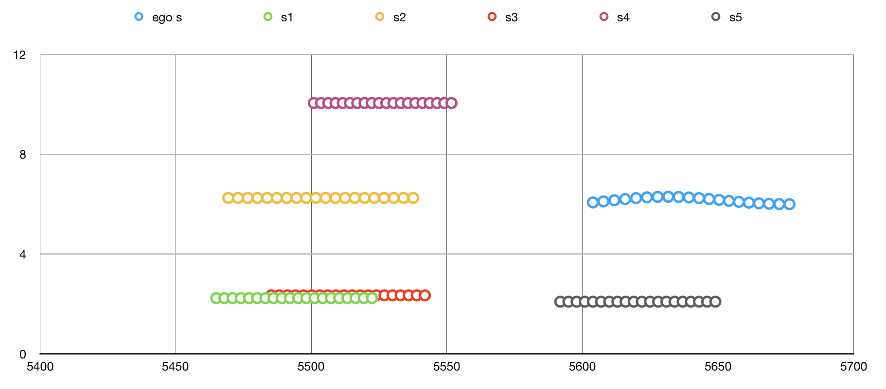
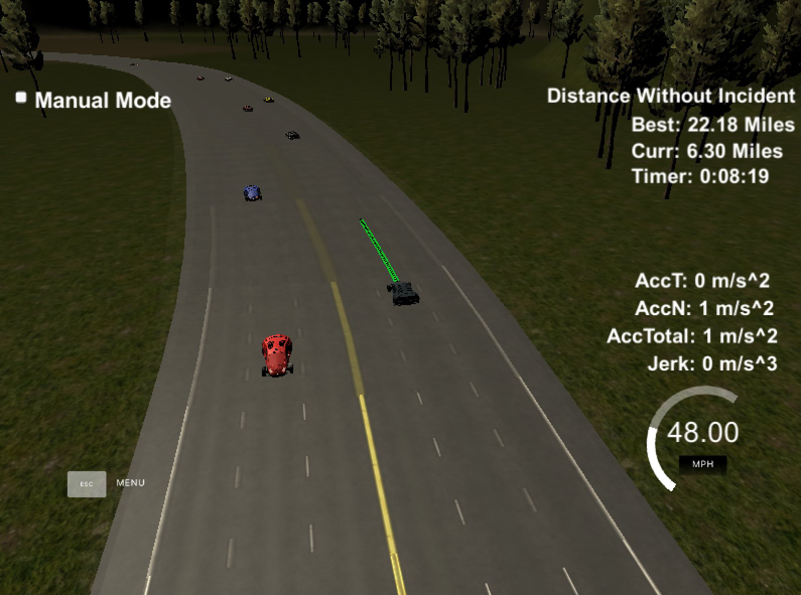

# Udacity Self-Driving Car Engineer Nanodegree
# Path Planning Project

## Introduction

The goal of this project is to navigate a car around a simulated highway scenario, including traffic and given waypoint, telemetry, and sensor fusion data. The car must not violate a set of motion constraints, namely maximum velocity, maximum acceleration, and maximum jerk, while also avoiding collisions with other vehicles, keeping to within a highway lane (aside from short periods of time while changing lanes), and changing lanes when doing so is necessary to maintain a speed near the posted speed limit.

This implementation is summarized in the following five steps:
1. Construct interpolated waypoints of nearby area
2. Determine ego car parameters and construct vehicle object
3. Generate predictions from sensor fusion data
4. Determine best trajectory
5. Produce new path

## Implementation

### 1. Construct Interpolated Waypoints of Nearby Area 

The track waypoints given in the `highway_map.csv` file are spaced roughly 30 meters apart, so the first step in the process is to interpolate a set of nearby map waypoints (in the current implementation, five waypoints ahead of and five waypoints behind the ego vehicle are used) and produce a set of much more tightly spaced (0.5 meters apart) waypoints which help to produce more accurate results from the `getXY` and `getFrenet` methods and also account for the discontinuity in `s` values at the end/beginning of the track.

### 2. Determine Ego Car Parameters and Construct Vehicle Object

The simulator returns instantaneous telemetry data for the ego vehicle, but it also returns the list of points from previously generated path. This is used to project the car's state into the future and a "planning state" is determined based on the difference between points at some prescribed number of points along the previous path. In effect, this can help to generate smoother transitions, handle latency from transmission between the controller and the simulator, and alleviate the trajectory generator of some computation overhead. 

The vehicle state and its associated (self-explanatory) methods are contained in the `Vehicle` class. These methods include `update_available_states` (i.e. "keep lane", "lane change left", "lane change right"), `get_target_for_state`, `generate_trajectory_for_target`, `get_leading_vehicle_data_for_lane`, and `generate_predictions` (for sensor fusion data).

### 3. Generate Predictions from Sensor Fusion Data

The sensor fusion data received from the simulator in each iteration is parsed and trajectories for each of the other cars on the road are generated. These trajectories match the duration and interval of the ego car's trajectories generated for each available state and are used in conjunction with a set of cost functions to determine a best trajectory for the ego car. A sample of these predicted trajectories (along with the ego car's predicted trajectory) is shown below.

### 4. Determine Best Trajectory

Using the ego car "planning state", sensor fusion predictions, and Vehicle class methods mentioned above, an optimal trajectory is produced. 

1. Available states are updated based on the ego car's current position, with some extra assistance from immediate sensor fusion data (I think of this similar to ADAS, helping to, for example, prevent "lane change left" as an available state if there is a car immediately to the left). 
2. Each available state is given a target Frenet state (position, velocity, and acceleration in both s and d dimensions) based on the current state and the traffic predictions. 
3. A quintic polynomial, jerk-minimizing (JMT) trajectory is produced for each available state and target (*note: although this trajectory was used for the final path plan in a previous approach, in the current implementation the JMT trajectory is only a rough estimate of the final trajectory based on the target state and using the `spline.h` library).
4. Each trajectory is evaluated according to a set of cost functions, and the trajectory with the lowest cost is selected. In the current implementation, these cost functions include:
  - Collision cost: penalizes a trajectory that collides with any predicted traffic trajectories.
  - Buffer cost: penalizes a trajectory that comes within a certain distance of another traffic vehicle trajectory.
  - In-lane buffer cost: penalizes driving in lanes with relatively nearby traffic.
  - Efficiency cost: penalizes trajectories with lower target velocity.
  - Not-middle-lane cost: penalizes driving in any lane other than the center in an effort to maximize available state options.

### 5. Produce New Path

The new path starts with a certain number of points from the previous path, which is received from the simulator at each iteration. From there a spline is generated beginning with the last two points of the previous path that have been kept (or the current position, heading, and velocity if no current path exists), and ending with two points 30 and 60 meters ahead and in the target lane. This produces a smooth x and y trajectory. To prevent excessive acceleration and jerk, the velocity is only allowed increment or decrement by a small amount, and the corresponding next x and y points are calculated along the x and y splines created earlier. 

## Conclusion

The resulting path planner works well, but not perfectly. It has managed to accumulate incident-free runs of over ten miles multiple times, and once navigating the track incident-free for over twenty miles (for which the image below is evidence). Improving the planner from this point is difficult due to the infrequency of infractions and inability to duplicate the circumstances that led up to an infraction. Overall, I am very satisfied with its performance.

